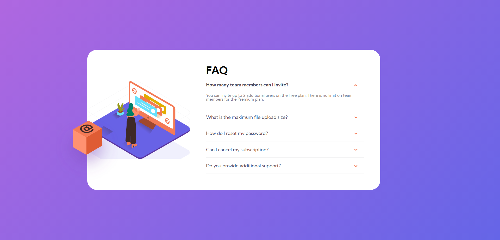

# Frontend Mentor - 3-column preview card component solution

This is a solution to the [3-column preview card component challenge on Frontend Mentor](https://www.frontendmentor.io/challenges/3column-preview-card-component-pH92eAR2-). Frontend Mentor challenges help you improve your coding skills by building realistic projects. 

## Table of contents

- [Overview](#overview)
  - [The challenge](#the-challenge)
  - [Screenshot](#screenshot)
  - [Links](#links)
- [Author](#author)
- [Acknowledgments](#acknowledgments)

**Note: Delete this note and update the table of contents based on what sections you keep.**

## Overview

### The challenge

Users should be able to:

- View the optimal layout depending on their device's screen size
- See hover states for interactive elements

### Screenshot

### Links
- Solution URL: [Add solution URL here](https://github.com/LuyandaDingindlela101/3-column-preview-card-component)
- Live Site URL: [Add live site URL here](https://3column-card-component.netlify.app/)

## Author

- Website - [Luyanda Dingindlela](https://luyanda-portfolio.netlify.app/)
- Frontend Mentor - [@LuyandaDingindlela101](https://www.frontendmentor.io/profile/LuyandaDingindlela101)